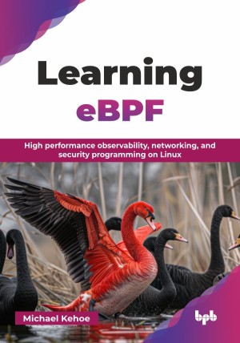

# Learning eBPF

High performance observability, networking, and security programming on Linux.

This is the repository for [Learning eBPF
]([https://bpbonline.com/products/get-set-go?variant=44629099020488](https://bpbonline.com/products/learning-ebpf?_pos=1&_sid=4f8bfdaac&_ss=r&variant=44627955024072)),published by BPB Publications.

## About the Book
Unlock the power of eBPF, the revolutionary Linux kernel technology transforming observability, networking, and security. This book serves as your comprehensive resource to master this cutting-edge technology, whether you are a beginner exploring its potential or a seasoned professional seeking in-depth knowledge.

Embark on a structured learning journey, starting with classic BPF (cBPF) and its evolution to modern eBPF, grasping its architecture and core programming primitives like the BPF syscall and various program/attachment types. Discover practical development using key eBPF programming libraries such as libbpf and bpftrace, and learn to write your first program. Explore BPF portability with CO-RE and efficient eBPF deployment. Uncover potent applications in eBPF observability (kprobes, tracepoints), eBPF networking (XDP, socket filters), and eBPF security. Finally, delve into key eBPF open-source projects like Cilium and Falco.

By the end of this definitive guide, you will possess a robust understanding of eBPF, equipped with the practical skills to develop, deploy, and leverage its immense capabilities across diverse domains, making you a proficient practitioner in this transformative field.

## What You Will Learn
• cBPF history, eBPF architecture, core primitives, and deployment.

• eBPF programming, portability, observability, networking, and security.

• BPF evolution, eBPF internals, practical application, and ecosystem.

• Kernel probing, packet manipulation, and secure eBPF development.

• eBPF tools, libraries, deployment strategies, and open-source projects.

• Tracing kernel/user space, network filtering/modification, and security enforcement.

• Understanding BPF syscall, program/attach types, and map utilization.

• Developing portable eBPF, managing lifecycle, and exploring use cases.
